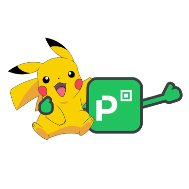

# Picpay Challenge - PokeAPI

    

## Testando os Notebooks

Por questão de simplicidade, foi usada a imagem docker `jupyter/pyspark-notebook` para o desenvolvimento da challenge.

Execute o comando `$ docker pull jupyter/pyspark-notebook` no shell ou powershell para iniciar o container e depois navegue para o endereço `http://localhost:8888`, faça o upload dos notebooks a citados a seguir e voilá.

No diretório **notebooks/pyspark** estão os notebooks desenvolvidos.

1. O arquivo **[PySpark] Desafio 1 - Python.ipynb** contempla o Desafio 1 - Python. Este notebook gera o arquivo **pokemon.csv**.

2. Os arquivos **[PySpark] Desafio 2 - (Passo 1) ELT pokemon_types.ipynb** e **[PySpark] Desafio 2 - (Passo 2) SQL.ipynb** (executados nesta mesma ordem), contemplam a o Desafio 2 - SQL. O Passo 1 gera o pokemon_types.csv necessário para que o Passo 2 execute a consulta requisitada no desafio.

## Autor

Rafael Luis da Costa Coelho